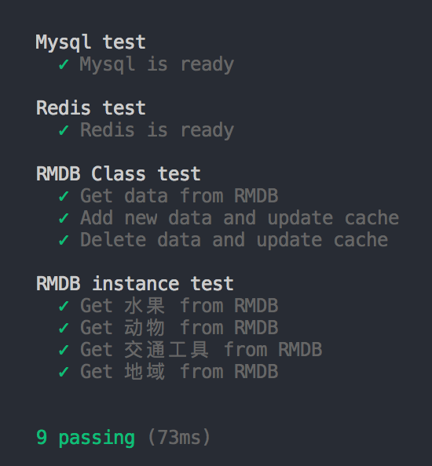

# rmdb
缓存与持久化策略

### Install
```sh
npm i rmdb --save
```

### Usage
```js
const RMDB = reuqire('rmdb')
```
推荐在业务中使用前先扩展一个基类，例如：
```js
const redis = require('async-redis').createClient()
const mysql = require('promise-mysql').createPool({
    host: 'centos.shared',
    user: 'root',
    password: 'root',
    database: 'test',
    connectionLimit: 10
})

class BaseRMDB extends RMDB {
    constructor(options) {
        options.redis = redis
        options.mysql = mysql
        super(options)
    }

    // 可以根据业务场景增加需要的方法逻辑
}

module.exports = BaseRMDB

```

#### 简单使用
直接实例化 BaseRMDB
```js
const rmdb = new BaseRMDB({
    timeout: 10,
    query: type => {
        return rmdb.mysql.query('select * from tag where type = ?', [type])
    }
})

// 水果: Redis缓存的Key
// 1: type 上文中query函数的type参数
// RMDB.prototype.get方法的参数会透传给RMDB.prototype.getFromMysql方法
// 如果RMDB.prototype.getFromMysql没有被子类重写，该参数将会继续被透传给基于query程式创建的查询函数中
const data = await rmdb.key('水果').get(1)
assert.equal(3, data.length)

const data = await rmdb.key('动物').get(2)
assert.equal(4, data.length)

const data = await rmdb.key('交通工具').get(3)
assert.equal(2, data.length)

const data = await rmdb.key('地域').get(4)
assert.equal(1, data.length)
```

#### 基于子类的应用
在BaseRMDB的基础上扩展子类
```js
class QQShare extends BaseRMDB {
    constructor() {
        super({key: 'qqShare', timeout: 10})
    }

    // getFromMysql: 内置允许重写的方法，返回值为Promise
    // 该方法声明了应该怎样从Mysql读取数据
    // 声明该方法之后只需要调用 RMDB.prototype.update 方法即可手动触发缓存更新
    // RMDB.prototype.get被调用时，如果Redis缓存不存在，将会调用getFromMysql自动重建Redis缓存
    getFromMysql() {
        return this.mysql.query('select * from user order by id desc limit 10')
    }
}

// 通过RMDB查询数据
const old = await qqShare.get()
// 更新Mysql
await qqShare.mysql.query('insert user(username, email) values("tom", 456)')
// 触发Redis缓存更新
await qqShare.update()
// 重新查询数据
const data = await qqShare.get()
// 对比缓存数据是否更新
assert.equal(++old.length, data.length)
```

### 单元测试
因为服务的特殊性，需要依赖Redis和Mysql进行测试，确认本地或远程有可用的测试数据库  
首先应该类似上文中示例中那样创建Redis和Mysql连接实例  
然后应基于``test/mock``目录下的``tag.sql``和``user.sql``创建``tag``表``user``表  
```sh
g clone https://github.com/gavinning/rmdb.git
cd rmdb
npm i
npm test
```


---
